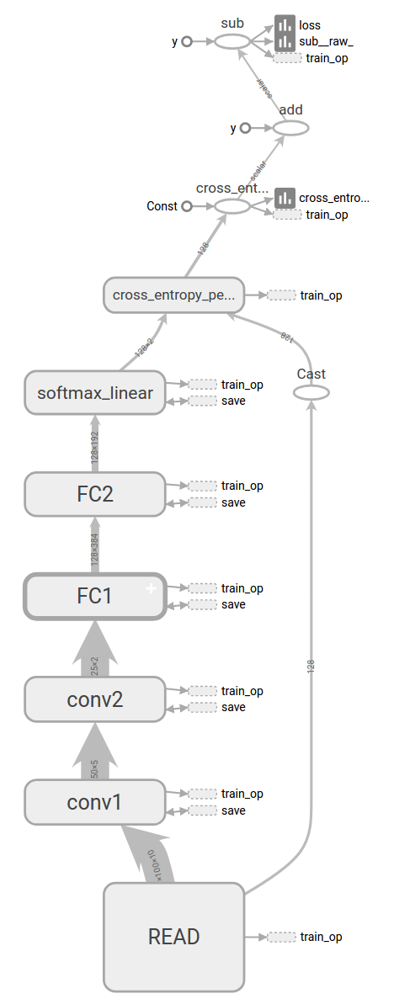
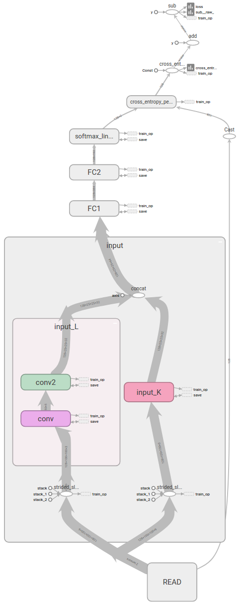
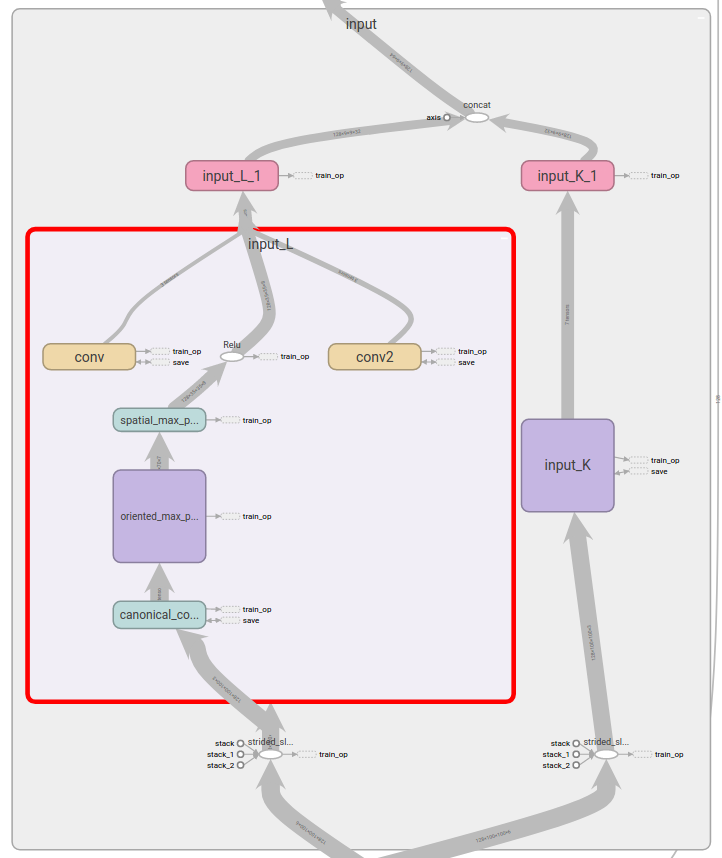
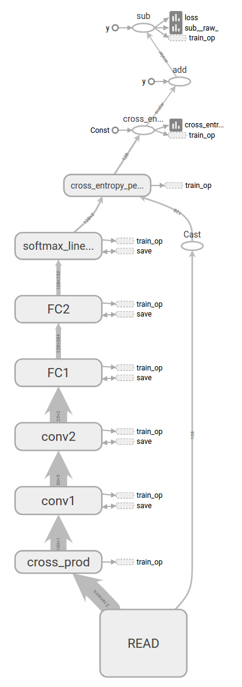
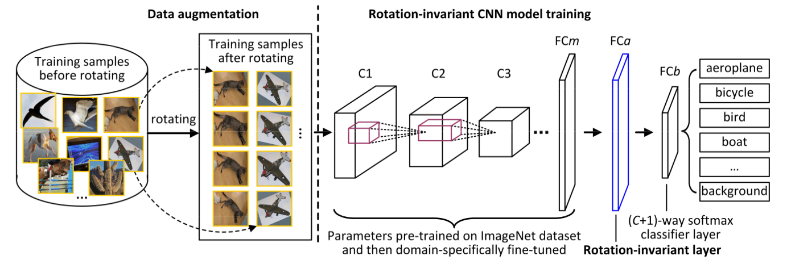

# Introduction of Models123343DJNBFHJBJNKFJNBHDRFBNJKDJUNF123343DJNBFHJBJNKFJNBHDRFBNJKDJUNF## Version 0 CIFAR-10123343DJNBFHJBJNKFJNBHDRFBNJKDJUNF123343DJNBFHJBJNKFJNBHDRFBNJKDJUNF​	CIFAR-10 is a famous image classification dataset, and TensorFlow Tutorial gives an implement of the network. The code is basically copied from [here](https://github.com/tensorflow/models/tree/master/tutorials/image/cifar10).123343DJNBFHJBJNKFJNBHDRFBNJKDJUNF123343DJNBFHJBJNKFJNBHDRFBNJKDJUNF​	The network has two convolutional layers, both have depth as 64. Then there are two fully connected layers. 123343DJNBFHJBJNKFJNBHDRFBNJKDJUNF123343DJNBFHJBJNKFJNBHDRFBNJKDJUNF​	The precision of this network is around **94.4%**, which is the worst.123343DJNBFHJBJNKFJNBHDRFBNJKDJUNF123343DJNBFHJBJNKFJNBHDRFBNJKDJUNF123343DJNBFHJBJNKFJNBHDRFBNJKDJUNF123343DJNBFHJBJNKFJNBHDRFBNJKDJUNF## Version 1 Process inputs respectively123343DJNBFHJBJNKFJNBHDRFBNJKDJUNF123343DJNBFHJBJNKFJNBHDRFBNJKDJUNF​	In this structure, the two input images are extracted features respectively, and then join into two full connection layers. The reason is that, there's no strong spatial connection between two images (they have their own translation and rotation), so it's not necessary and inappropriate to overlay them together as a 6-channel input. Features should be extracted respectively and then analyzed and classified by full connection layers instead of convolutional layer. 123343DJNBFHJBJNKFJNBHDRFBNJKDJUNF123343DJNBFHJBJNKFJNBHDRFBNJKDJUNF​	Different convolutional layer depth are tested. Here is the results.123343DJNBFHJBJNKFJNBHDRFBNJKDJUNF123343DJNBFHJBJNKFJNBHDRFBNJKDJUNF| depth           | 16    | 32    | 64    |123343DJNBFHJBJNKFJNBHDRFBNJKDJUNF| --------------- | ----- | ----- | ----- |123343DJNBFHJBJNKFJNBHDRFBNJKDJUNF| without dropout | 97.4% | 97.7% | 96.7% |123343DJNBFHJBJNKFJNBHDRFBNJKDJUNF| with dropout    | 97.1% | 97.6% | 97.5% |123343DJNBFHJBJNKFJNBHDRFBNJKDJUNF123343DJNBFHJBJNKFJNBHDRFBNJKDJUNF123343DJNBFHJBJNKFJNBHDRFBNJKDJUNF123343DJNBFHJBJNKFJNBHDRFBNJKDJUNF123343DJNBFHJBJNKFJNBHDRFBNJKDJUNF123343DJNBFHJBJNKFJNBHDRFBNJKDJUNF## Version 2 Process inputs with rotation invariance respectively123343DJNBFHJBJNKFJNBHDRFBNJKDJUNF123343DJNBFHJBJNKFJNBHDRFBNJKDJUNF​	Add the rotation invariant architecture into the network to process the rotation of inputs. The paper I refer to is [Learning rotation invariant convolutional filters for texture classification](https://arxiv.org/pdf/1604.06720.pdf). 123343DJNBFHJBJNKFJNBHDRFBNJKDJUNF123343DJNBFHJBJNKFJNBHDRFBNJKDJUNF​	This structure is not tested, because the the training speed is slow and I think the performance is hardly good. But it's quite a good thinking. Instead of using distorted(rotated) input to help the network get used to the rotation of inputs, we can let the network structure itself learn the distortion as well.123343DJNBFHJBJNKFJNBHDRFBNJKDJUNF123343DJNBFHJBJNKFJNBHDRFBNJKDJUNF123343DJNBFHJBJNKFJNBHDRFBNJKDJUNF123343DJNBFHJBJNKFJNBHDRFBNJKDJUNF## Version 3 Cross product input images123343DJNBFHJBJNKFJNBHDRFBNJKDJUNF123343DJNBFHJBJNKFJNBHDRFBNJKDJUNF​	It's a thinking of how to let the two inputs relate to each other - by cross production. However, this network won't converge in practice.123343DJNBFHJBJNKFJNBHDRFBNJKDJUNF123343DJNBFHJBJNKFJNBHDRFBNJKDJUNF123343DJNBFHJBJNKFJNBHDRFBNJKDJUNF123343DJNBFHJBJNKFJNBHDRFBNJKDJUNF## Version 4 Rotation Invariant Layer123343DJNBFHJBJNKFJNBHDRFBNJKDJUNF123343DJNBFHJBJNKFJNBHDRFBNJKDJUNF​	It' another approach to maintain rotation-invariance ([reference](http://www.cv-foundation.org/openaccess/content_cvpr_2016/papers/Cheng_RIFD-CNN_Rotation-Invariant_and_CVPR_2016_paper.pdf)). Different from Version 2, this approach uses a special rotation-invariant layer plus rotation augmented input data.  The main idea of this architecture is to enforce the network to learn those rotational-invariant features from input data.123343DJNBFHJBJNKFJNBHDRFBNJKDJUNF123343DJNBFHJBJNKFJNBHDRFBNJKDJUNF123343DJNBFHJBJNKFJNBHDRFBNJKDJUNF123343DJNBFHJBJNKFJNBHDRFBNJKDJUNF​	Unfortunately, I tested this approach on CIFAR-10 dataset using Tensorflow's simple cifar10 model. But it doesn't perform well. 